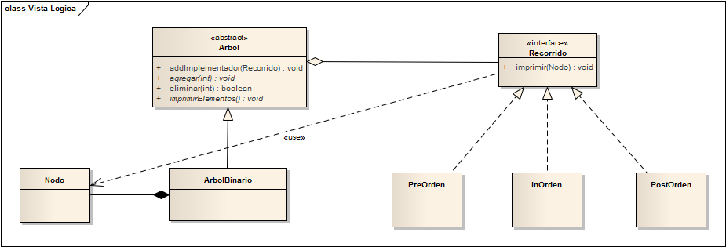

# PatternBridge-Example

La estructura de un Bridge se puede clasificar en dos partes: la parte abstracta y las diferentes implementaciones, de modo que la relación se hace mediante una agregación de la interfaz a la clase abstracta, de esta forma podemos obtener una abstracción con comportamientos independientes.

Cuando un objeto tiene unas implementaciones posibles, la manera habitual de implementación es el uso de herencias. Muchas veces la herencia se puede tornar inmanejable o no es lo suficientemente flexible y, por otro lado, acopla la abstracción con una implementación concreta, y si, es porque las dos están ligadas, pero este patrón busca eliminar esa inconveniencia, para permitir que las abstracciones e implementaciones evolucionen independientemente.